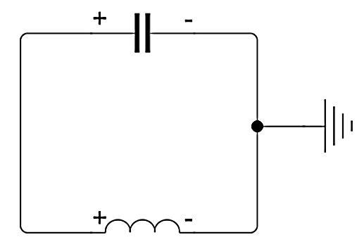

# Математическое моделирование колебательного контура
## Постановка задачи
Дана электрическая схема, состоящая из идеального конденсатора ёмкостью $С=1Ф$, идеального индуктора индуктивностью $L=1Гн$
и заземления. Пусть в начальный момент времени конденсатор заряжен до $1 В$, а ток в цепи отсутствует.
<br>

</br>
Необходимо:
1. Составить соответствующую схеме задачу Коши для системы обыкновенных дифференциальных уравнений
и решить её любым численным методом на интервале $t\in[0; 100]$. Использование готовых решателей для интегрирования задачи Коши **запрещается**.
2. Построить графики $I(t)$ и $U(t)$.

## Решение
### Математическая модель
Сперва напишем систему уравнений, описывающих поведение цепи. Для этого воспользуемся правилами Кирхгофа и запишем следующие соотношения:
$$
\begin{cases}
u_C(t) + u_L(t) = 0 \\
i_C(t) = i_L(t) = i
\end{cases}
$$
Где:
$$
u_L(t) = L\frac{di_L(t)}{d t} \\
i_C(t)=C\frac{du_C(t)}{d t}
$$
Преобразуем уравнения относительно тока:
$$
L\frac{di(t)}{d t} + \frac{1}{C}\int\limits_ti(t)dt=0
$$
Продифференцируем обе части уравнения:
$$
\frac{d^2 i(t)}{d^2 t} + \frac{1}{LC} i(t) = 0
$$
Заменим переменные:
$$
i(t)=y_1 \\ 
\frac{di(t)}{d t}=y_2
$$
Тогда мы можем сделать окончательную постановку задачи Коши для заданного электрического контура (сразу в векторном виде):
$$
\begin{cases}
\frac{d}{d t}\binom{y_1}{y_2}=\binom{y_2}{- \frac{1}{LC}y_1} \\
y_1(t_0) = 0 \\
y_2(t_0) = - \frac{U_C}{L} = 1 \\
t\in[0; 100]
\end{cases}
$$
### Реализация численного метода
Для решения поставленной задачи Коши реализован решатель [методом Эйлера](https://en.wikipedia.org/wiki/Euler_method). ```